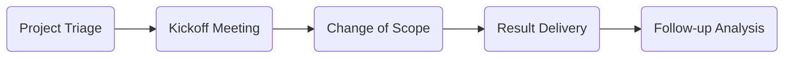

## Best Practice for Projects
{: .no_toc}

1. TOC
{:toc}

---

### Mindset

#### What is our responsibility?
{: .no_toc}
#### We are here to help clients' success!
{: .no_toc .text-red-100}
- Figure out what are clients' needs and objectives
- Align with your clients. You are not in the opposite positions
- Provide your expertise to help clients clarify business needs
  - We have obligation to explain risk and limitation
  - Client is the one to make final decision
  - It is okay to have disagreement with the decisions, BUT need commitment
  - Document each step of decision making and the risk/limitation via email, then archive email

#### How to achieve this goal?
{: .no_toc}
#### Aim to solve the problem!
{: .no_toc .text-red-100}
- If there is a conflict, propose solutions/options along with providing sufficient evidences for challenges/difficulties
  - Express your understanding and intention to solve the problem
  - Ask clients' needs at minimum level and provide options
  - Do NOT explain why we cannot do it all along
  - Discuss the way to avoid those situations in future
- Be prepared to work overtime for urgent and high priority projects if it is inevitable

#### Work flow with client
{: .no_toc}

||More details|
|:---|:---|
|Project Triage|- New request via Email: a) Request a discussion/meeting with analytical lead (avoid communication via emails) b) Before the discussion/meeting, review related materials, prepare questions, and estimate timeline  - New request directly from a meeting: a) Provide meeting minutes after the meeting b) Raise any possible questions related to the request, determine difficulty about the project, and estimate timeline|

| Selector              | Small screen size `font-size`    | Large screen size `font-size` |
|:----------------------|:---------------------------------|:------------------------------|
| `h1`, `.text-alpha`   | 3 2px                        | 36px                          |
| `h2`, `.text-beta`    | 18px                             | 24px                          |
| `h3`, `.text-gamma`   | 16px                             | 18px                          |
| `h4`, `.text-delta`   | 14px                             | 16px                          |
| `h5`, `.text-epsilon` | 16px                             | 18px                          |
| `h6`, `.text-zeta`    | 18px                             | 24px                          |
| `body`                | 14px                             | 16px                          |
